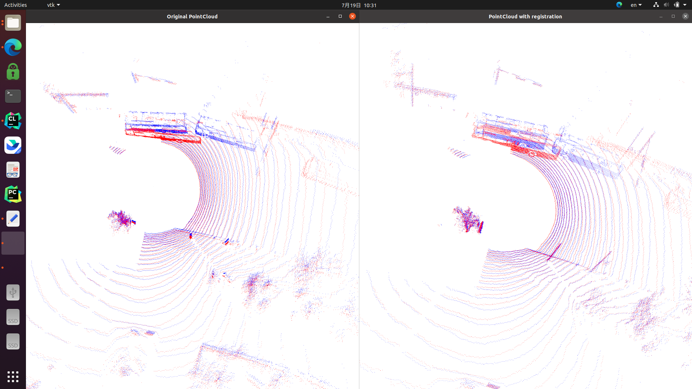

# SC^2-PCR: A Second Order Spatial Compatibility for Efficient and Robust Point Cloud Registration (CVPR 2022)

Libtorch implementation of the paper:

[SC^2-PCR: A Second Order Spatial Compatibility for Efficient and Robust Point Cloud Registration](https://arxiv.org/abs/2203.14453).

Zhi Chen, [Kun Sun](https://scholar.google.com/citations?user=Ay6kCm4AAAAJ&hl=en), Fan Yang, [Wenbing Tao](https://scholar.google.co.uk/citations?user=jRDPE2AAAAAJ&hl=zh-CN&oi=ao).

[Original Pytorch version](https://github.com/ZhiChen902/SC2-PCR)

## Requirements
This work has been test on Ubuntu 20.04 and you also need CUDA-toolkit.

### PCL
### [Libtorch](https://download.pytorch.org/libtorch/cu102/libtorch-cxx11-abi-shared-with-deps-1.12.0%2Bcu102.zip)
cxx11 ABI version is required

### [YAML](https://github.com/jbeder/yaml-cpp)

## Build Options:
    (Modify your libtorch path in CMakeList.txt before compilation)
    mkdir build
    cd build
    cmake ..
 Then run the file:

    ./build/visualize

The original point cloud and the aligned point cloud are shown on screen

